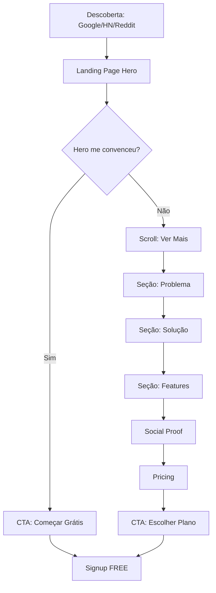

# Landing Page PromptZero - Planejamento Completo de Conversão

## 1. Estratégia de Conversão e Estrutura da Página

### 1.1 Objetivo Principal

Converter visitantes em usuários do plano FREE (signup) e criar awareness sobre os planos pagos (PRO/BUSINESS/ENTERPRISE).

### 1.2 Jornada do Visitante




### 1.3 Estrutura das Seções (Ordem de Conversão)

**Arquitetura da página:**

1. **Hero Section** - 5 segundos de impacto
2. **Problema/Dor** - Identificação emocional
3. **Solução Visual** - Demo/Screenshot persuasivo
4. **Triple Value Prop** - 3 benefícios killer
5. **Features Showcase** - 6 features com ícones
6. **Social Proof** - Testimonials + métricas
7. **Comparação Competitiva** - PromptZero vs outros
8. **Pricing** - Planos com CTA forte
9. **FAQ** - Objeções respondidas
10. **Final CTA** - Última oportunidade de conversão

---

## 2. Copywriting Detalhado por Seção

### SEÇÃO 1: Hero Section (Above the Fold)

**Objetivo:** Capturar atenção em 5 segundos e comunicar valor único.

#### Headline Principal (H1)

```
Reduza 40% dos Custos com LLMs.
Automaticamente.
```

**Por quê funciona:**

- Número específico (40%)
- Benefício claro (reduzir custos)
- "Automaticamente" = sem esforço
- Curto e direto

#### Subheadline (H2)

```
A plataforma completa de LLMOps que combina cache inteligente,
A/B testing de prompts e observabilidade profunda para times
que levam IA a sério.
```

**Por quê funciona:**

- "Plataforma completa" = tudo em um lugar
- 3 features killer em uma frase
- "Times que levam IA a sério" = posicionamento premium

#### CTA Primário

```
[Botão] Começar Grátis • 10K execuções/mês
[Texto pequeno] Sem cartão de crédito • Setup em 15 minutos
```

**Por quê funciona:**

- Verde lime vibrante (cor primária)
- "Grátis" + limite específico
- Remove fricção (sem cartão)
- Expectativa clara (15min)

#### CTA Secundário

```
[Link] Ver Demo ao Vivo →
```

#### Visual Hero

- **Screenshot:** Dashboard analytics com gráficos reais
- **Overlay sutil:** Badge "40% de economia" com destaque lime
- **Fundo:** Grid sutil com gradiente escuro → lime (marca)

---

### SEÇÃO 2: Problema/Dor (Pain Amplification)

**Objetivo:** Fazer o visitante pensar "isso é exatamente o meu problema".

#### Headline

```
Seus custos de LLM estão explodindo.
E você não sabe por quê.
```

#### 3 Problemas Visuais (Grid)

**Card 1: Custos**

```
💸 Queries Repetidas
"40% das suas chamadas para GPT-4 são perguntas
que você já fez antes. Você está pagando duas vezes
pelo mesmo resultado."
```

**Card 2: Qualidade**

```
🎲 Prompts Inconsistentes
"Qual versão do prompt funciona melhor? Você não sabe.
Está otimizando no escuro, baseado em 'feeling'."
```

**Card 3: Visibilidade**

```
👻 Zero Observabilidade
"Seu LLM travou em produção. Quantos tokens usou?
Qual foi a latência? Você não tem ideia."
```

**Estatística de Impacto (Badge central):**

```
🚨 Empresas gastam em média $15K/mês com LLMs
   mas economizam 0% porque não medem nada.
```

---

### SEÇÃO 3: Solução Visual (Product Demo)

**Objetivo:** Mostrar que a solução existe e é tangível.

#### Headline

```
Controle Total Sobre Seus LLMs.
Num Único Dashboard.
```

#### Demonstração Interativa

- **Screenshot grande:** Dashboard PromptZero
- **3 Hotspots clicáveis:**

**Hotspot 1 - Analytics**

```
💰 Savings em Tempo Real
Veja quanto você economizou com cache.
Breakdown por modelo, workspace e período.
```

**Hotspot 2 - A/B Testing**

```
🧪 Teste Científico
Compare 2 prompts lado a lado.
Sistema de votação + análise estatística.
```

**Hotspot 3 - Traces**

```
🔍 Distributed Tracing
Cada execução rastreada do início ao fim.
OpenTelemetry + correlação com logs.
```

---

### SEÇÃO 4: Triple Value Prop

**Objetivo:** 3 benefícios irresistíveis em formato escanável.

#### Headline

```
Por Que Times de IA Escolhem PromptZero
```

#### Benefit 1: Economia Automática

```
💰 Cache Inteligente que Paga Por Si Mesmo

O cache semântico do PromptZero identifica queries
similares e retorna resultados instantâneos.

➔ 40% de redução nos custos da OpenAI
➔ 90% menos latência em queries repetidas
➔ ROI positivo desde o primeiro mês
```

#### Benefit 2: Qualidade Comprovada

```
🎯 A/B Testing Científico de Prompts

Pare de adivinhar qual prompt é melhor.
Teste, meça e escolha o vencedor com confiança estatística.

➔ Split de tráfego configurável (50/50, 70/30, etc)
➔ Win rate + intervalo de confiança
➔ Métricas de latência e custo por variante
```

#### Benefit 3: Visibilidade Total

```
🔍 Observabilidade Nível Datadog

Stack completa: Prometheus + Loki + Tempo + OpenTelemetry.
Saiba exatamente o que acontece em cada execução.

➔ Traces distribuídos com spans detalhados
➔ Logs estruturados correlacionados
➔ Alertas customizados (Slack, email, PagerDuty)
```

---

### SEÇÃO 5: Features Showcase

**Objetivo:** Mostrar amplitude de funcionalidades.

#### Headline

```
Tudo Que Você Precisa Para Gerenciar LLMs em Produção
```

#### Grid 2x3 de Features

**Feature 1: Multi-Provider**

```
🌐 4 Providers, 1 Interface
OpenAI • Anthropic • Google Gemini • OpenRouter

Troque de modelo sem refatorar código.
Failover automático se um provider cair.
```

**Feature 2: Versionamento**

```
📚 Git para Prompts
Versionamento automático a cada edição.
Histórico completo + diff + rollback.
Compare v1 vs v23 e escolha a melhor.
```

**Feature 3: Templates Dinâmicos**

```
🧩 Variáveis Reutilizáveis
{{topic}}, {{tone}}, {{platform}}

Crie prompts parametrizados.
Tipos: text, textarea, select.
```

**Feature 4: Webhooks**

```
🔗 Integre com Tudo
Dispare eventos para Slack, Discord, Zapier.

Notificações automáticas:
• Execução completada
• Experimento finalizado
• Custo atingiu threshold
```

**Feature 5: Platform API**

```
🔑 API Pública + SDKs
Python • JavaScript • LangChain Callback

Execute prompts programaticamente.
API keys criptografadas (AES-256-GCM).
```

**Feature 6: Workspaces & Teams**

```
👥 Multi-Tenancy Nativo
Organize por projetos ou equipes.

Permissões granulares.
Audit log completo.
SSO (SAML, Google, Azure AD).
```

---

### SEÇÃO 6: Social Proof

**Objetivo:** Reduzir risco percebido e criar FOMO.

#### Headline

```
Usado por Times de IA que Crescem Rápido
```

#### Métricas de Credibilidade

```
[Badge] 10.000+ Execuções/dia
[Badge] 99.5% Uptime SLA
[Badge] 30-40% Economia Comprovada
```

#### Testimonials (3 cards)

**Testimonial 1: CTO - Startup**

```
"Reduzimos $4K/mês em custos da OpenAI só com o cache.
O A/B testing melhorou nossa taxa de conversão em 23%."

— João Silva, CTO @ TechStartup (Series A)
[Foto] [Logo empresa]
```

**Testimonial 2: PM - Scale-up**

```
"Antes do PromptZero, não sabíamos qual prompt funcionava.
Agora testamos cientificamente e escolhemos com dados."

— Maria Santos, Product Manager @ FastGrowth
[Foto] [Logo empresa]
```

**Testimonial 3: DevOps - Enterprise**

```
"A observabilidade é nivel Datadog. Traces, logs, métricas
tudo correlacionado. Identificamos gargalos em minutos."

— Carlos Mendes, SRE @ CorpBrasil
[Foto] [Logo empresa]
```

#### Trust Badges

```
[Badge] Open-Source SDKs
[Badge] SOC2 Compliant
[Badge] GDPR Ready
[Badge] Uptime 99.5%
```

---

### SEÇÃO 7: Comparação Competitiva

**Objetivo:** Posicionar como melhor opção vs Helicone/Langfuse.

#### Headline

```
PromptZero vs Outros
(E Por Que Migraram Para Nós)
```

#### Tabela Comparativa


| Feature                  | PromptZero        | Helicone | Langfuse    |
| ------------------------ | ----------------- | -------- | ----------- |
| **Cache de Respostas**   | ✅ Semântico       | ✅ Básico | ❌           |
| **A/B Testing Nativo**   | ✅ Completo        | ❌        | ❌           |
| **Observabilidade Full** | ✅ Prom+Loki+Tempo | Básico   | Logs apenas |
| **Webhooks**             | ✅                 | ❌        | ❌           |
| **Billing Integrado**    | ✅ Stripe          | ❌        | ❌           |
| **Proxy Mode (1 linha)** | ✅                 | ✅        | ❌           |
| **Preço (100K/mês)**     | **$79**           | $79*     | $29         |


*Helicone cobra por volume de ingestão

#### Unique Selling Points (3 badges)

```
[Badge] Única com A/B Testing ✅
[Badge] Stack de Observabilidade Completa ✅
[Badge] Billing SaaS Integrado ✅
```

---

### SEÇÃO 8: Pricing

**Objetivo:** Mostrar planos claros com CTA forte no PRO.

#### Headline

```
Preços Transparentes.
Sem Surpresas.
```

#### 4 Cards de Planos

**FREE** (Card neutro)

```
Grátis
Para sempre

10.000 execuções/mês
2 usuários
7 dias retenção
1 workspace

✅ Todos os 4 providers
✅ Versionamento
✅ Analytics básico
✅ Playground

[Botão secundário] Começar Grátis
```

**PRO** (Card destaque - borda lime + badge "Mais Popular")

```
$79/mês
ou $790/ano (2 meses grátis)

100.000 execuções/mês
Usuários ilimitados
90 dias retenção
5 workspaces

Tudo do FREE +
✅ Cache inteligente (40% economia)
✅ A/B testing
✅ Webhooks
✅ Platform API
✅ Datasets ilimitados
✅ Suporte 48h

[Botão primário lime] Começar Teste Grátis
[Texto] Overage: $5/10K execuções
```

**BUSINESS** (Card premium)

```
$299/mês
ou $2.990/ano

500.000 execuções/mês
Usuários ilimitados
1 ano retenção
Workspaces ilimitados

Tudo do PRO +
✅ Proxy/Gateway mode
✅ Roteamento inteligente
✅ Alertas customizados
✅ SSO (SAML, Google, Azure)
✅ RBAC avançado
✅ Suporte 24h
✅ SLA 99.5%

[Botão] Agendar Demo
```

**ENTERPRISE** (Card dark)

```
Custom
A partir de $999/mês

2M+ execuções/mês
Configuração customizada

Tudo do BUSINESS +
✅ Self-hosted
✅ White label
✅ Retenção forever
✅ Engenheiro dedicado
✅ SLA 99.9%
✅ Professional services

[Botão] Falar com Vendas
```

#### FAQ Pricing (Abaixo dos cards)

```
💡 O que acontece se eu passar do limite?
➔ Cobrança automática: $5 por 10K execuções adicionais (Pro)

💡 Posso trocar de plano a qualquer momento?
➔ Sim! Upgrade instantâneo, downgrade no próximo ciclo.

💡 Oferecem desconto para anual?
➔ Sim! 2 meses grátis (economize ~17%).
```

---

### SEÇÃO 9: FAQ (Objeções Respondidas)

**Objetivo:** Remover fricções e objeções comuns.

#### Headline

```
Perguntas Frequentes
```

#### 8 FAQs Essenciais

**1. Como o cache economiza dinheiro?**

```
O PromptZero identifica queries semanticamente similares e retorna
resultados instantâneos do cache, sem chamar o LLM novamente.

Exemplo: "Crie um post sobre marketing digital" e "Escreva post
sobre marketing digital" são tratadas como a mesma query.

Economia típica: 30-40% dos custos mensais.
```

**2. Preciso mudar meu código para integrar?**

```
Não! Temos 3 opções:

• Proxy mode (1 linha): Mude apenas a baseURL
• SDK (Python/JS): Integração com 5 linhas
• Platform API: Use via REST

Você escolhe o que faz sentido para seu caso.
```

**3. Meus dados ficam seguros?**

```
Sim. Usamos criptografia AES-256-GCM para API keys,
bcrypt para senhas, JWT com refresh token rotation.

Opções de compliance:
• Cloud: SOC2, GDPR ready
• Self-hosted: Seus dados nunca saem da sua infra
```

**4. Funciona com meu framework (LangChain/LlamaIndex)?**

```
Sim! Temos callback oficial para LangChain e integração
com LlamaIndex via SDK Python.

Auto-instrumentação de traces para chains complexas.
```

**5. O que acontece se eu cancelar?**

```
Você volta para o plano FREE automaticamente.
Seus prompts e dados permanecem intactos.

Sem lock-in, sem penalidade.
```

**6. Qual a diferença entre vocês e Helicone/Langfuse?**

```
PromptZero combina o melhor dos dois + features únicas:

• Cache + Proxy (como Helicone)
• Observabilidade profunda (como Langfuse)
• A/B testing nativo (ninguém mais tem)
• Billing integrado (ninguém mais tem)
```

**7. Oferecem trial do plano pago?**

```
Sim! 14 dias de trial no plano PRO.
Sem cartão de crédito necessário.

Teste cache, A/B testing e todas as features.
```

**8. Como funciona o suporte?**

```
• FREE: Discord community
• PRO: Email (resposta em 48h)
• BUSINESS: Chat dedicado (24h)
• ENTERPRISE: Engenheiro no Slack Connect

Todos os planos têm documentação completa + tutoriais em vídeo.
```

---

### SEÇÃO 10: Final CTA (Last Chance)

**Objetivo:** Última oportunidade de converter o visitante.

#### Design

- **Fundo:** Gradiente dark → lime (dramático)
- **Largura:** Full-width, altura generosa

#### Headline

```
Reduza Seus Custos de LLM em 40%.
Começando Hoje.
```

#### Subheadline

```
10.000 execuções grátis por mês. Sem cartão de crédito.
Setup em 15 minutos.
```

#### CTA Duplo

```
[Botão Primário Lime - XL] Começar Grátis Agora →

[Link abaixo] Ou agende uma demo personalizada
```

#### Trust Elements (abaixo do CTA)

```
✓ Sem compromisso  ✓ Cancele quando quiser  ✓ Suporte em português
```

---

## 3. Brand Guide Completo - Design System

### 3.1 Identidade Visual

**Nome:** PromptZero  
**Tagline:** "Zero Friction, Full Control"  
**Tom de Voz:** Técnico mas acessível, confiante sem ser arrogante, direto  
**Personalidade:** Profissional • Moderno • Data-driven • Developer-first

### 3.2 Paleta de Cores (OKLCH)

#### Cores Primárias

```css
/* Verde Lime - Cor primária/destaque */
--pz-lime: oklch(0.918 0.244 127.5)       /* Botões, links, highlights */
--pz-lime-dim: oklch(0.698 0.185 127.5)   /* Hover states */
--pz-lime-glow: oklch(0.918 0.244 127.5 / 0.15) /* Shadows/glows */

/* Preto Profundo - Base dark */
--pz-black: oklch(0.043 0.002 285.8)      /* Background dark */
--pz-dark: oklch(0.073 0.003 285.8)       /* Surface dark */
--pz-surface: oklch(0.113 0.004 285.8)    /* Cards dark */

/* Branco Suave - Base light */
--pz-white: oklch(0.975 0.001 285.8)      /* Text light mode */
```

#### Cores Secundárias

```css
/* Cyan - Tecnologia/dados */
--pz-cyan: oklch(0.798 0.156 210.5)

/* Violet - Premium/enterprise */
--pz-violet: oklch(0.628 0.225 293.5)

/* Coral - Atenção/destaque */
--pz-coral: oklch(0.678 0.195 25.5)

/* Amber - Avisos */
--pz-amber: oklch(0.798 0.175 85.5)
```

#### Cores Funcionais

```css
--pz-success: oklch(0.698 0.195 145.5)   /* Verde sucesso */
--pz-danger: oklch(0.628 0.235 27.5)     /* Vermelho erro */
--pz-warning: oklch(0.748 0.185 75.5)    /* Amarelo aviso */
```

#### Esquema de Uso

- **Background principal:** pz-black (dark) / pz-white (light)
- **Cards/Surfaces:** pz-surface (dark) / white (light)
- **CTAs primários:** pz-lime com hover pz-lime-dim
- **CTAs secundários:** border pz-lime com hover bg-pz-lime/10
- **Links:** pz-lime com underline
- **Badges de destaque:** bg-pz-lime + text-pz-black

### 3.3 Tipografia

#### Fontes

```css
/* Headings - Space Mono (monospace moderna) */
--font-heading: 'Space Mono', monospace;
font-weight: 400 (regular), 700 (bold)

/* Corpo - DM Sans (sans-serif limpa) */
--font-sans: 'DM Sans', sans-serif;
font-weight: 300, 400, 500, 600, 700

/* Código - JetBrains Mono */
--font-mono: 'JetBrains Mono', monospace;
font-weight: 400, 500, 600
```

#### Hierarquia Tipográfica

```
H1 (Hero Headline)
Font: Space Mono Bold
Size: 56px / 3.5rem (desktop), 36px / 2.25rem (mobile)
Line Height: 1.1
Letter Spacing: -0.02em
Color: foreground (text-foreground)

H2 (Section Headlines)
Font: Space Mono Bold
Size: 40px / 2.5rem (desktop), 28px / 1.75rem (mobile)
Line Height: 1.2
Letter Spacing: -0.01em

H3 (Subsection Titles)
Font: DM Sans Semibold
Size: 28px / 1.75rem (desktop), 20px / 1.25rem (mobile)
Line Height: 1.3

H4 (Card Titles)
Font: DM Sans Semibold
Size: 20px / 1.25rem
Line Height: 1.4

Body Large (Hero Subheadline)
Font: DM Sans Regular
Size: 20px / 1.25rem
Line Height: 1.6
Color: muted-foreground

Body (Parágrafo padrão)
Font: DM Sans Regular
Size: 16px / 1rem
Line Height: 1.6

Body Small (Fine print)
Font: DM Sans Regular
Size: 14px / 0.875rem
Line Height: 1.5

Caption
Font: DM Sans Medium
Size: 12px / 0.75rem
Line Height: 1.4
Text Transform: uppercase
Letter Spacing: 0.05em
```

### 3.4 Espaçamento e Grid

#### Sistema de Espaçamento (8pt grid)

```
xs:  4px  (0.25rem)
sm:  8px  (0.5rem)
md:  16px (1rem)
lg:  24px (1.5rem)
xl:  32px (2rem)
2xl: 48px (3rem)
3xl: 64px (4rem)
4xl: 96px (6rem)
5xl: 128px (8rem)
```

#### Layout Container

```
Max Width: 1280px (80rem)
Padding Horizontal: 24px (mobile), 48px (desktop)
Margin: 0 auto
```

#### Seção Spacing

```
Section Padding Vertical: 80px (mobile), 128px (desktop)
Section Gap: 48px (mobile), 80px (desktop)
```

#### Card Spacing

```
Padding: 24px (mobile), 32px (desktop)
Gap entre cards: 24px
Border Radius: 12px (0.75rem)
```

### 3.5 Componentes de UI

#### Botões

**Botão Primário (CTA Principal)**

```css
Background: var(--pz-lime)
Color: var(--pz-black)
Font: DM Sans Semibold
Size: 16px
Padding: 16px 32px
Border Radius: 8px
Box Shadow: 0 4px 20px var(--pz-lime-glow)

Hover:
  Background: var(--pz-lime-dim)
  Box Shadow: 0 8px 30px var(--pz-lime-glow)
  Transform: translateY(-2px)
  
States:
  Active: scale(0.98)
  Disabled: opacity(0.5)
```

**Botão Secundário**

```css
Background: transparent
Border: 2px solid var(--pz-lime)
Color: var(--pz-lime)
Font: DM Sans Semibold
Size: 16px
Padding: 14px 30px
Border Radius: 8px

Hover:
  Background: oklch(from var(--pz-lime) l c h / 0.1)
  Border Color: var(--pz-lime-dim)
```

**Botão Link**

```css
Background: transparent
Color: var(--pz-lime)
Font: DM Sans Medium
Size: 16px
Text Decoration: underline
Text Underline Offset: 4px

Hover:
  Color: var(--pz-lime-dim)
```

#### Cards

**Card Padrão**

```css
Background: var(--card)
Border: 1px solid var(--border)
Border Radius: 12px
Padding: 32px
Box Shadow: 0 1px 3px rgba(0,0,0,0.1)

Hover:
  Border Color: var(--pz-lime)
  Box Shadow: 0 8px 30px rgba(0,0,0,0.12)
  Transform: translateY(-4px)
```

**Card Destaque (Pricing PRO)**

```css
Background: var(--card)
Border: 2px solid var(--pz-lime)
Border Radius: 12px
Padding: 32px
Box Shadow: 0 8px 40px var(--pz-lime-glow)
Position: relative

Badge "Mais Popular":
  Position: absolute
  Top: -12px
  Right: 32px
  Background: var(--pz-lime)
  Color: var(--pz-black)
  Padding: 4px 12px
  Border Radius: 6px
  Font: DM Sans Bold
  Size: 12px
  Text Transform: uppercase
```

#### Badges

```css
Background: var(--pz-lime)
Color: var(--pz-black)
Font: DM Sans Semibold
Size: 12px
Padding: 6px 12px
Border Radius: 6px
Text Transform: uppercase
Letter Spacing: 0.05em
```

#### Ícones

- **Biblioteca:** Hugeicons + Lucide React
- **Tamanho padrão:** 24px
- **Cor:** Herda do texto ou pz-lime para destaque
- **Stroke Width:** 2px

### 3.6 Efeitos e Animações

#### Transitions

```css
/* Padrão */
transition: all 0.2s cubic-bezier(0.4, 0, 0.2, 1);

/* Hover (mais suave) */
transition: all 0.3s cubic-bezier(0.4, 0, 0.2, 1);

/* Entrada/saída (bounce) */
transition: all 0.4s cubic-bezier(0.68, -0.55, 0.265, 1.55);
```

#### Hover States

```css
/* Elevação */
transform: translateY(-4px);
box-shadow: 0 8px 30px rgba(0,0,0,0.15);

/* Glow (lime) */
box-shadow: 0 8px 40px var(--pz-lime-glow);

/* Scale */
transform: scale(1.05);
```

#### Scroll Animations

```
Fade In + Slide Up:
  Initial: opacity(0) translateY(30px)
  Animate: opacity(1) translateY(0)
  Duration: 0.6s
  Delay: Stagger 0.1s por elemento
```

#### Gradientes

**Hero Background**

```css
background: radial-gradient(
  ellipse at top,
  oklch(0.073 0.003 285.8),
  oklch(0.043 0.002 285.8)
);
```

**CTA Final Background**

```css
background: linear-gradient(
  135deg,
  oklch(0.043 0.002 285.8) 0%,
  oklch(0.113 0.004 285.8) 50%,
  oklch(from var(--pz-lime) l c h / 0.2) 100%
);
```

### 3.7 Imagens e Ilustrações

#### Screenshots

- **Formato:** PNG com fundo transparente ou WebP
- **Resolução:** 2x retina (1920px largura mínima)
- **Border Radius:** 12px
- **Box Shadow:** 0 20px 60px rgba(0,0,0,0.3)
- **Browser Chrome:** Incluir barra de navegação fake (credibilidade)

#### Ilustrações

- **Estilo:** Isométrico ou flat 3D
- **Cores:** Paleta PromptZero (lime, cyan, violet)
- **Background:** Transparente
- **Detalhamento:** Alto (não genérico)

#### Ícones Decorativos

- **Tamanho:** 48px - 64px
- **Estilo:** Outline stroke 2px
- **Cor:** pz-lime com gradiente para pz-cyan

---

## 4. Prompt Completo para Geração do Site

### 4.1 Contexto do Produto

```markdown
PRODUTO: PromptZero - Plataforma SaaS de LLMOps

DESCRIÇÃO:
PromptZero é a plataforma completa para gerenciamento, teste e otimização
de prompts de IA. Combina cache inteligente (economia de 40% nos custos),
A/B testing científico de prompts e observabilidade profunda (Prometheus +
Loki + Tempo + OpenTelemetry).

DIFERENCIAL ÚNICO:
Única plataforma que oferece A/B testing nativo + billing integrado +
stack completa de observabilidade. Posicionamento entre Helicone (gateway)
e Langfuse (observabilidade), mas com features que nenhum dos dois tem.

PÚBLICO-ALVO:
- Primário: Startups tech Series A-C, 5-50 engenheiros, gastando $5K+/mês em LLMs
- Secundário: Scale-ups (50-500 funcionários) com múltiplos times de IA
- Terciário: Enterprises com requisitos de compliance e self-hosting

PROPOSTA DE VALOR:
"Reduza 40% dos custos com LLMs automaticamente, teste prompts cientificamente
e tenha visibilidade total sobre suas aplicações de IA."

TONE OF VOICE:
- Técnico mas acessível (fala com desenvolvedores, não com leigos)
- Confiante sem arrogância (data-driven, não hype)
- Direto e específico (números reais, não promessas vagas)
- Profissional mas humano (não é corporativo engessado)
```

### 4.2 Prompt para Modelos de Geração de Sites

```markdown
# PROMPT PARA GERAÇÃO DA LANDING PAGE PROMPTZERO

Você vai criar uma landing page de alta conversão para o PromptZero,
uma plataforma SaaS de LLMOps. A página deve ser tecnicamente impressionante,
visualmente moderna e persuasiva.

## OBJETIVO
Converter visitantes (desenvolvedores/CTOs de startups de IA) em usuários
do plano FREE (signup) e criar awareness sobre planos pagos.

## ESTRUTURA DA PÁGINA (10 seções)

### 1. HERO SECTION (Above the fold - 100vh)
**Headline (H1):**
"Reduza 40% dos Custos com LLMs. Automaticamente."

**Subheadline:**
"A plataforma completa de LLMOps que combina cache inteligente, A/B testing
de prompts e observabilidade profunda para times que levam IA a sério."

**CTAs:**
- Primário: [Botão lime XL] "Começar Grátis • 10K execuções/mês"
  Abaixo: "Sem cartão de crédito • Setup em 15 minutos"
- Secundário: [Link] "Ver Demo ao Vivo →"

**Visual:**
Screenshot grande do dashboard analytics com overlay de badge
"40% de economia" destacado.

**Background:**
Gradiente radial escuro (pz-black → pz-dark) com grid sutil.

---

### 2. PROBLEMA/DOR (Padding vertical: 128px)
**Headline:** "Seus custos de LLM estão explodindo. E você não sabe por quê."

**Grid 3 problemas (cards):**

Card 1:
```

💸 Queries Repetidas
40% das suas chamadas para GPT-4 são perguntas que você já fez antes.
Você está pagando duas vezes pelo mesmo resultado.

```

Card 2:
```

🎲 Prompts Inconsistentes
Qual versão do prompt funciona melhor? Você não sabe.
Está otimizando no escuro, baseado em 'feeling'.

```

Card 3:
```

👻 Zero Observabilidade
Seu LLM travou em produção. Quantos tokens usou? Qual foi a latência?
Você não tem ideia.

```

**Badge central (destaque):**
"🚨 Empresas gastam $15K/mês com LLMs mas economizam 0% porque não medem nada."

---

### 3. SOLUÇÃO VISUAL (Padding vertical: 128px)
**Headline:** "Controle Total Sobre Seus LLMs. Num Único Dashboard."

**Screenshot grande do produto com 3 hotspots clicáveis:**

Hotspot 1 (Analytics):
```

💰 Savings em Tempo Real
Veja quanto você economizou com cache.
Breakdown por modelo, workspace e período.

```

Hotspot 2 (A/B Testing):
```

🧪 Teste Científico
Compare 2 prompts lado a lado.
Sistema de votação + análise estatística.

```

Hotspot 3 (Traces):
```

🔍 Distributed Tracing
Cada execução rastreada do início ao fim.
OpenTelemetry + correlação com logs.

```

---

### 4. TRIPLE VALUE PROP (Padding vertical: 128px)
**Headline:** "Por Que Times de IA Escolhem PromptZero"

**3 Benefits (grid horizontal):**

Benefit 1:
```

💰 Cache Inteligente que Paga Por Si Mesmo
O cache semântico identifica queries similares e retorna resultados instantâneos.

➔ 40% de redução nos custos da OpenAI
➔ 90% menos latência em queries repetidas
➔ ROI positivo desde o primeiro mês

```

Benefit 2:
```

🎯 A/B Testing Científico de Prompts
Pare de adivinhar qual prompt é melhor. Teste, meça e escolha com confiança.

➔ Split de tráfego configurável
➔ Win rate + intervalo de confiança
➔ Métricas de latência e custo por variante

```

Benefit 3:
```

🔍 Observabilidade Nível Datadog
Stack completa: Prometheus + Loki + Tempo + OpenTelemetry.

➔ Traces distribuídos com spans detalhados
➔ Logs estruturados correlacionados
➔ Alertas customizados (Slack, email, PagerDuty)

```

---

### 5. FEATURES SHOWCASE (Padding vertical: 128px)
**Headline:** "Tudo Que Você Precisa Para Gerenciar LLMs em Produção"

**Grid 2x3 de features (cards com ícones):**

Feature 1: 🌐 Multi-Provider (OpenAI • Anthropic • Gemini • OpenRouter)
Feature 2: 📚 Versionamento (Git para prompts, histórico completo)
Feature 3: 🧩 Templates Dinâmicos (Variáveis reutilizáveis)
Feature 4: 🔗 Webhooks (Integre com Slack, Discord, Zapier)
Feature 5: 🔑 Platform API (Python • JavaScript • LangChain)
Feature 6: 👥 Workspaces & Teams (Multi-tenancy, SSO, RBAC)

---

### 6. SOCIAL PROOF (Padding vertical: 128px, fundo pz-surface)
**Headline:** "Usado por Times de IA que Crescem Rápido"

**Métricas:**
[Badge] 10.000+ Execuções/dia
[Badge] 99.5% Uptime SLA
[Badge] 30-40% Economia Comprovada

**3 Testimonials (cards com foto + logo):**

Testimonial 1:
```

"Reduzimos $4K/mês em custos da OpenAI só com o cache.
O A/B testing melhorou nossa conversão em 23%."
— João Silva, CTO @ TechStartup

```

Testimonial 2:
```

"Antes do PromptZero, não sabíamos qual prompt funcionava.
Agora testamos cientificamente."
— Maria Santos, PM @ FastGrowth

```

Testimonial 3:
```

"A observabilidade é nível Datadog. Identificamos gargalos em minutos."
— Carlos Mendes, SRE @ CorpBrasil

```

**Trust Badges:**
[Badge] Open-Source SDKs
[Badge] SOC2 Compliant
[Badge] GDPR Ready

---

### 7. COMPARAÇÃO COMPETITIVA (Padding vertical: 128px)
**Headline:** "PromptZero vs Outros (E Por Que Migraram Para Nós)"

**Tabela comparativa:**
PromptZero vs Helicone vs Langfuse

Mostrar que PromptZero tem:
✅ Cache + A/B Testing + Observabilidade Full + Webhooks + Billing
(Features que nenhum concorrente tem todas)

**USPs:**
[Badge] Única com A/B Testing
[Badge] Stack de Observabilidade Completa
[Badge] Billing SaaS Integrado

---

### 8. PRICING (Padding vertical: 128px)
**Headline:** "Preços Transparentes. Sem Surpresas."

**4 Cards de planos (responsivo):**

FREE: $0 - 10K exec/mês, features básicos
PRO: $79/mês - 100K exec/mês, cache + A/B + webhooks [DESTAQUE - borda lime]
BUSINESS: $299/mês - 500K exec/mês, SSO + RBAC + SLA
ENTERPRISE: Custom - self-hosted + white label

Card PRO deve ter:
- Badge "Mais Popular" no topo
- Borda 2px lime com glow
- Botão CTA primário mais destacado

---

### 9. FAQ (Padding vertical: 128px)
**Headline:** "Perguntas Frequentes"

**8 FAQs (accordion style):**
1. Como o cache economiza dinheiro?
2. Preciso mudar meu código?
3. Meus dados ficam seguros?
4. Funciona com LangChain?
5. O que acontece se eu cancelar?
6. Diferença entre vocês e Helicone/Langfuse?
7. Oferecem trial?
8. Como funciona o suporte?

---

### 10. FINAL CTA (Full-width, padding vertical: 128px)
**Background:** Gradiente dark → lime (dramático)

**Headline:**
"Reduza Seus Custos de LLM em 40%. Começando Hoje."

**Subheadline:**
"10.000 execuções grátis por mês. Sem cartão de crédito. Setup em 15 minutos."

**CTA:**
[Botão XL lime] "Começar Grátis Agora →"
[Link] "Ou agende uma demo personalizada"

**Trust elements:**
✓ Sem compromisso  ✓ Cancele quando quiser  ✓ Suporte em português

---

## DESIGN SYSTEM (Brand Guide)

### CORES (OKLCH)
```css
/* Primárias */
--pz-lime: oklch(0.918 0.244 127.5);      /* CTAs, highlights */
--pz-black: oklch(0.043 0.002 285.8);     /* Background dark */
--pz-white: oklch(0.975 0.001 285.8);     /* Text light */

/* Secundárias */
--pz-cyan: oklch(0.798 0.156 210.5);      /* Tech/data */
--pz-violet: oklch(0.628 0.225 293.5);    /* Premium */
--pz-surface: oklch(0.113 0.004 285.8);   /* Cards dark */
--pz-border: oklch(0.173 0.006 285.8);    /* Borders dark */
```

**Modo escuro (padrão):**

- Background: pz-black
- Surface/Cards: pz-surface
- Text: pz-white
- Primary: pz-lime
- Borders: pz-border

### TIPOGRAFIA

```css
/* Headings */
font-family: 'Space Mono', monospace;
font-weight: 700;

H1 (Hero): 56px / 3.5rem (desktop), 36px / 2.25rem (mobile)
H2 (Sections): 40px / 2.5rem (desktop), 28px / 1.75rem (mobile)
H3: 28px / 1.75rem

/* Body */
font-family: 'DM Sans', sans-serif;

Body Large (Hero sub): 20px / 1.25rem
Body: 16px / 1rem
Small: 14px / 0.875rem
```

**Line heights:**

- Headlines: 1.1 - 1.2
- Body: 1.6

**Letter spacing:**

- Headlines: -0.02em (H1), -0.01em (H2)
- Badges/Caps: 0.05em

### ESPAÇAMENTO (8pt grid)

```
Section padding: 128px vertical (desktop), 80px (mobile)
Cards: 32px padding, 24px gap
Buttons: 16px vertical, 32px horizontal
Border radius: 8px (botões), 12px (cards)
```

### COMPONENTES

**Botão Primário (Lime):**

```css
background: var(--pz-lime);
color: var(--pz-black);
padding: 16px 32px;
border-radius: 8px;
font: DM Sans Semibold 16px;
box-shadow: 0 4px 20px oklch(from var(--pz-lime) l c h / 0.15);

hover:
  background: oklch(0.698 0.185 127.5);  /* lime-dim */
  transform: translateY(-2px);
  box-shadow: 0 8px 30px oklch(from var(--pz-lime) l c h / 0.25);
```

**Botão Secundário:**

```css
background: transparent;
border: 2px solid var(--pz-lime);
color: var(--pz-lime);
padding: 14px 30px;
border-radius: 8px;

hover:
  background: oklch(from var(--pz-lime) l c h / 0.1);
```

**Card Padrão:**

```css
background: var(--pz-surface);
border: 1px solid var(--pz-border);
border-radius: 12px;
padding: 32px;

hover:
  border-color: var(--pz-lime);
  transform: translateY(-4px);
```

**Card Destaque (Pricing PRO):**

```css
border: 2px solid var(--pz-lime);
box-shadow: 0 8px 40px oklch(from var(--pz-lime) l c h / 0.15);

Badge "Mais Popular":
  position: absolute top -12px right 32px;
  background: var(--pz-lime);
  color: var(--pz-black);
  padding: 4px 12px;
  border-radius: 6px;
  font: DM Sans Bold 12px uppercase;
```

### ANIMAÇÕES

```css
/* Transitions */
transition: all 0.2s cubic-bezier(0.4, 0, 0.2, 1);

/* Hover elevation */
transform: translateY(-4px);

/* Scroll animations */
Fade in + slide up:
  from: opacity(0) translateY(30px)
  to: opacity(1) translateY(0)
  duration: 0.6s
  stagger: 0.1s
```

### IMAGENS

- Screenshots: PNG/WebP 2x retina, border-radius 12px
- Box shadow: 0 20px 60px rgba(0,0,0,0.3)
- Incluir browser chrome fake para credibilidade

### ÍCONES

- Tamanho: 24px (inline), 48-64px (decorativos)
- Stroke: 2px
- Cor: inherit ou pz-lime

---

## ESPECIFICAÇÕES TÉCNICAS

### RESPONSIVIDADE

- Mobile first: 375px mínimo
- Breakpoints: 640px (sm), 768px (md), 1024px (lg), 1280px (xl)
- Container max-width: 1280px
- Grid: 12 colunas (desktop), stack vertical (mobile)

### PERFORMANCE

- Lazy load imagens abaixo da dobra
- WebP com fallback PNG
- Fonts: preload Space Mono e DM Sans
- Hero image: optimized, <200KB

### ACESSIBILIDADE

- Contraste: WCAG AA mínimo (4.5:1 texto normal, 3:1 texto grande)
- Focus states visíveis (outline lime)
- Texto alt em todas as imagens
- Landmarks semânticos (header, main, section, footer)
- Botões com aria-labels

### SEO

```html
<title>PromptZero - Reduza 40% dos Custos com LLMs | Plataforma LLMOps</title>
<meta name="description" content="Plataforma completa de LLMOps com cache inteligente, A/B testing e observabilidade. Economize 40% em custos de OpenAI/Anthropic. Grátis até 10K execuções/mês.">
<meta property="og:title" content="PromptZero - Plataforma LLMOps">
<meta property="og:image" content="https://promptzero.com/og-image.png">
```

---

## INSTRUÇÕES FINAIS

ESTILO VISUAL:

- Moderno mas não excessivamente futurista
- Dark mode por padrão (tech aesthetic)
- Lime como cor de destaque (contraste forte com dark)
- Cards com elevação sutil, não flat
- Generoso white space

COPYWRITING:

- Números específicos (40%, $79/mês, 10K execuções)
- Benefícios claros, não features abstratas
- Tom confiante mas não arrogante
- Falar diretamente com desenvolvedores/CTOs

CONVERSÃO:

- CTAs visíveis acima da dobra
- Remover fricções (sem cartão, grátis, 15min setup)
- Social proof credível (não genérico)
- Plano PRO destacado (sweet spot de conversão)

DIFERENCIAÇÃO:

- Enfatizar A/B testing (ninguém mais tem)
- Enfatizar stack completa de observabilidade
- Posicionar como "all-in-one" vs concorrentes
- Mostrar que é produto maduro, não MVP

---

Agora crie esta landing page seguindo EXATAMENTE estas especificações.
A página deve ser indistinguível de uma landing page SaaS profissional
de empresas como Vercel, Stripe ou Railway.

```

---

## 5. Checklist de Implementação

### 5.1 Antes de Desenvolver
- [ ] Validar estrutura com stakeholders
- [ ] Aprovar copywriting de cada seção
- [ ] Definir imagens/screenshots necessários
- [ ] Preparar logos de clientes para testimonials
- [ ] Configurar domínio e certificado SSL

### 5.2 Durante Desenvolvimento
- [ ] Implementar seções na ordem (Hero → Final CTA)
- [ ] Testar responsividade em cada seção
- [ ] Validar contraste de cores (WCAG AA)
- [ ] Implementar scroll animations
- [ ] Otimizar imagens (WebP + lazy load)

### 5.3 Testes Pré-Launch
- [ ] Teste em 5 dispositivos diferentes
- [ ] Lighthouse score >90 (Performance, A11y, SEO)
- [ ] Testar todos os CTAs
- [ ] Validar tracking de conversões (analytics)
- [ ] Verificar meta tags Open Graph

### 5.4 Pós-Launch
- [ ] Monitorar taxa de conversão por seção (heatmap)
- [ ] A/B test do headline hero
- [ ] Coletar feedback de primeiros visitantes
- [ ] Iterar copywriting baseado em objeções reais
- [ ] Adicionar case studies quando disponíveis

---

## 6. Métricas de Sucesso

### 6.1 Conversão
- **Taxa de signup (FREE):** 5-8% dos visitantes únicos
- **Scroll depth:** >60% chegam ao pricing
- **Bounce rate:** <40%
- **Tempo na página:** >2 minutos

### 6.2 Engajamento
- **Cliques no CTA hero:** >3% dos visitantes
- **Visualizações de demo:** >10% dos visitantes
- **Leitura FAQ:** >15% dos visitantes

### 6.3 Qualidade de Tráfego
- **Taxa de ativação (primeiro prompt):** >70% dos signups
- **Conversão FREE → PRO:** 5-10% em 30 dias

---

Este planejamento fornece uma estrutura completa e altamente persuasiva para a landing page do PromptZero, com copywriting orientado a conversão, design system detalhado e um prompt pronto para uso com ferramentas de geração de sites.
```

